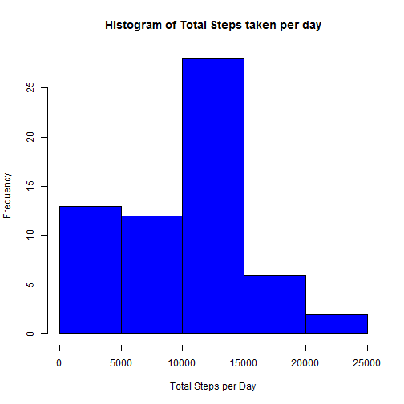
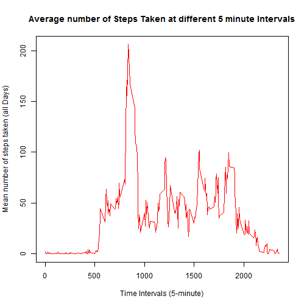
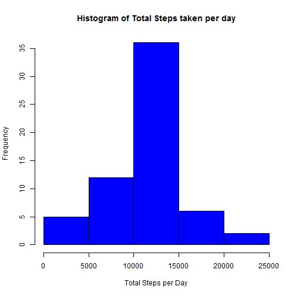

# Reproducible Research: Peer Assessment 1
========================================================

## Loading and preprocessing the data


```r
mydata<-read.csv("c:/Users/Administrator/repdata-data-activity/activity.csv",header=T, colClasses=c("numeric","Date","numeric"))
```

## What is mean total number of steps taken per day?
##For this part of the assignment, you can ignore the missing values in the dataset.


```r
total_steps<-tapply(mydata$steps,mydata$date,sum, na.rm=T)
total_steps
```

```
## 2012-10-01 2012-10-02 2012-10-03 2012-10-04 2012-10-05 2012-10-06 
##          0        126      11352      12116      13294      15420 
## 2012-10-07 2012-10-08 2012-10-09 2012-10-10 2012-10-11 2012-10-12 
##      11015          0      12811       9900      10304      17382 
## 2012-10-13 2012-10-14 2012-10-15 2012-10-16 2012-10-17 2012-10-18 
##      12426      15098      10139      15084      13452      10056 
## 2012-10-19 2012-10-20 2012-10-21 2012-10-22 2012-10-23 2012-10-24 
##      11829      10395       8821      13460       8918       8355 
## 2012-10-25 2012-10-26 2012-10-27 2012-10-28 2012-10-29 2012-10-30 
##       2492       6778      10119      11458       5018       9819 
## 2012-10-31 2012-11-01 2012-11-02 2012-11-03 2012-11-04 2012-11-05 
##      15414          0      10600      10571          0      10439 
## 2012-11-06 2012-11-07 2012-11-08 2012-11-09 2012-11-10 2012-11-11 
##       8334      12883       3219          0          0      12608 
## 2012-11-12 2012-11-13 2012-11-14 2012-11-15 2012-11-16 2012-11-17 
##      10765       7336          0         41       5441      14339 
## 2012-11-18 2012-11-19 2012-11-20 2012-11-21 2012-11-22 2012-11-23 
##      15110       8841       4472      12787      20427      21194 
## 2012-11-24 2012-11-25 2012-11-26 2012-11-27 2012-11-28 2012-11-29 
##      14478      11834      11162      13646      10183       7047 
## 2012-11-30 
##          0
```

```r
sum(total_steps)
```

```
## [1] 570608
```

##Make a histogram of the total number of steps taken each day


```r
hist(total_steps, col="blue",xlab="Total Steps per Day", 
      ylab="Frequency", main="Histogram of Total Steps taken per day")
```

 


##Calculate and report the mean and median total number of steps taken per day


```r
mean(total_steps,na.rm=T)
```

```
## [1] 9354
```

```r
median(total_steps,na.rm=T)
```

```
## [1] 10395
```

## What is the average daily activity pattern?

##Make a time series plot (i.e. type = "l") of the 5-minute interval (x-axis) and the average number of steps taken, averaged across all days (y-axis)


```r
average_steps<-tapply(mydata$steps, mydata$interval, mean, na.rm=T)

plot(row.names(average_steps),average_steps,type="l",
     xlab="Time Intervals (5-minute)", 
     ylab="Mean number of steps taken (all Days)", 
     main="Average number of Steps Taken at different 5 minute Intervals",
     col="red")
```

 


##Which 5-minute interval, on average across all the days in the dataset, contains the maximum number of steps?


```r
interval_number <- which.max(average_steps)
interval_max_steps <- names(interval_number)
interval_max_steps
```

```
## [1] "835"
```
The ** 835** minute  or ** 104th ** 5 minute interval contains the maximum number of steps on average across all the days.


## Imputing missing values

##Calculate and report the total number of missing values in the dataset (i.e. the total number of rows with NAs)


```r
na_values<-sum(is.na(mydata))
na_values
```

```
## [1] 2304
```


## Filling in all of the missing values in the dataset by using the mean for that 5-minute interval.

##Create a new dataset that is equal to the original dataset but with the missing data filled in.


```r
na_indices <-  which(is.na(mydata))
imputed_values <- average_steps[as.character(mydata[na_indices,3])]
names(imputed_values) <- na_indices
for (i in na_indices) {
    mydata$steps[i] = imputed_values[as.character(i)]
}
sum(is.na(mydata)) # The number of NAs after imptation should be 0
```

```
## [1] 0
```


##Make a histogram of the total number of steps taken each day and Calculate and report the mean and median total number of steps taken per day. Do these values differ from the estimates from the first part of the assignment? What is the impact of imputing missing data on the estimates of the total daily number of steps?


```r
total_steps<-tapply(mydata$steps,mydata$date,sum)
total_steps
```

```
## 2012-10-01 2012-10-02 2012-10-03 2012-10-04 2012-10-05 2012-10-06 
##      10766        126      11352      12116      13294      15420 
## 2012-10-07 2012-10-08 2012-10-09 2012-10-10 2012-10-11 2012-10-12 
##      11015      10766      12811       9900      10304      17382 
## 2012-10-13 2012-10-14 2012-10-15 2012-10-16 2012-10-17 2012-10-18 
##      12426      15098      10139      15084      13452      10056 
## 2012-10-19 2012-10-20 2012-10-21 2012-10-22 2012-10-23 2012-10-24 
##      11829      10395       8821      13460       8918       8355 
## 2012-10-25 2012-10-26 2012-10-27 2012-10-28 2012-10-29 2012-10-30 
##       2492       6778      10119      11458       5018       9819 
## 2012-10-31 2012-11-01 2012-11-02 2012-11-03 2012-11-04 2012-11-05 
##      15414      10766      10600      10571      10766      10439 
## 2012-11-06 2012-11-07 2012-11-08 2012-11-09 2012-11-10 2012-11-11 
##       8334      12883       3219      10766      10766      12608 
## 2012-11-12 2012-11-13 2012-11-14 2012-11-15 2012-11-16 2012-11-17 
##      10765       7336      10766         41       5441      14339 
## 2012-11-18 2012-11-19 2012-11-20 2012-11-21 2012-11-22 2012-11-23 
##      15110       8841       4472      12787      20427      21194 
## 2012-11-24 2012-11-25 2012-11-26 2012-11-27 2012-11-28 2012-11-29 
##      14478      11834      11162      13646      10183       7047 
## 2012-11-30 
##      10766
```

```r
sum(total_steps) # Due to the imputed values, the estimates of the total daily number of steps is higher,
```

```
## [1] 656738
```

```r
hist(total_steps, col="blue",xlab="Total Steps per Day", 
      ylab="Frequency", main="Histogram of Total Steps taken per day")
```

 

```r
mean(total_steps)
```

```
## [1] 10766
```

```r
median(total_steps)
```

```
## [1] 10766
```


## Are there differences in activity patterns between weekdays and weekends?

##Create a new factor variable in the dataset with two levels - "weekday" and "weekend" indicating whether a given date is a weekday or weekend day.


```r
days <- weekdays(mydata$date)
mydata$day_type <- ifelse(days == "Saturday" | days == "Sunday", 
                                "Weekend", "Weekday")
```


##Make a panel plot containing a time series plot (i.e. type = "l") of the 5-minute interval (x-axis) and the average number of steps taken, averaged across all weekday days or weekend days (y-axis). 


```r
library(lattice)
average_steps <- aggregate(mydata$steps,by=list(mydata$interval,mydata$day_type),mean)
names(average_steps) <- c("interval","day_type","steps")
xyplot(steps~interval | day_type,average_steps,type="l",
       layout=c(1,2),xlab="Interval",ylab = "Number of steps")
```

 


